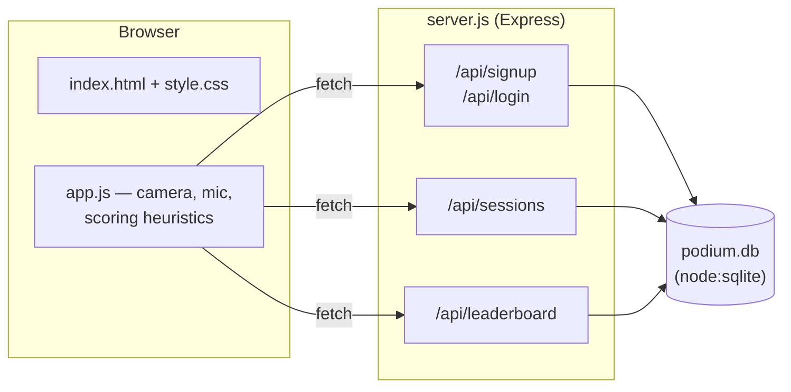
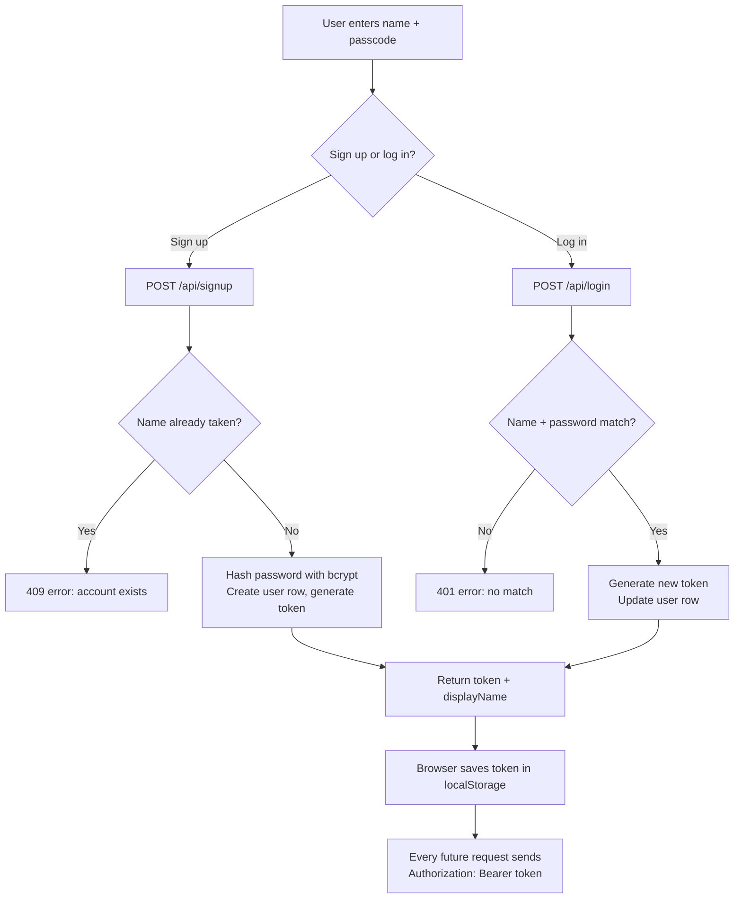
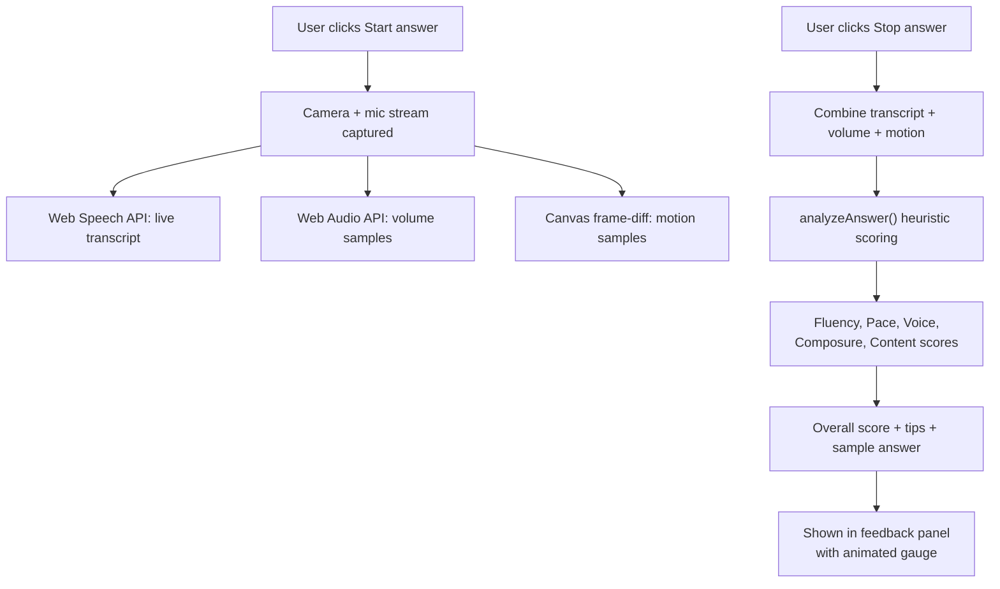
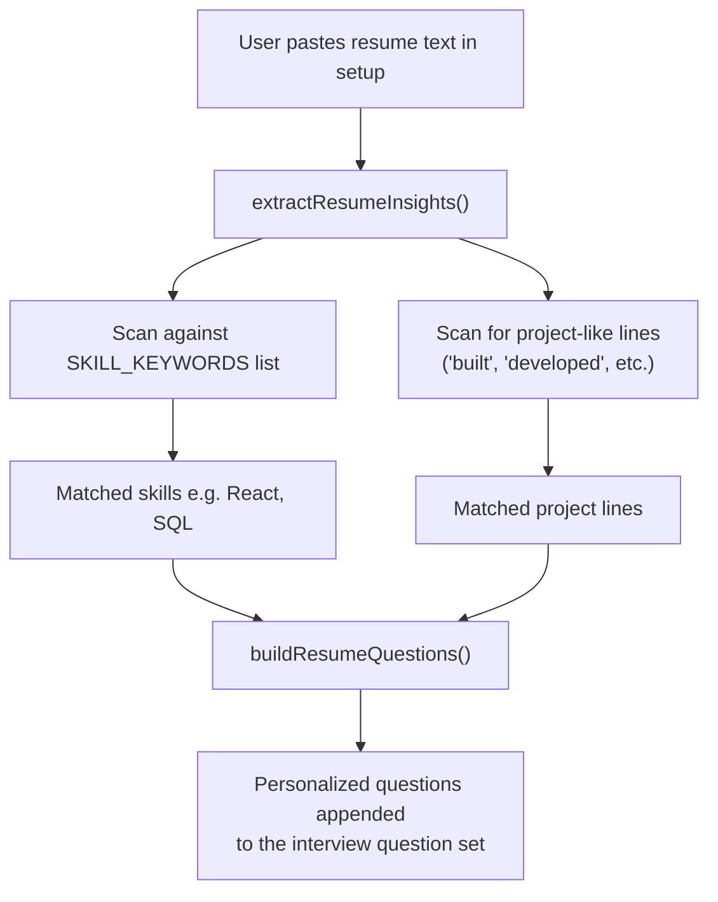
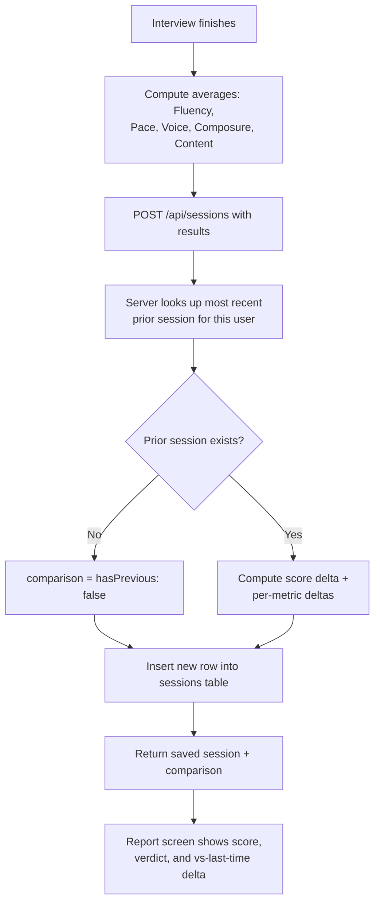
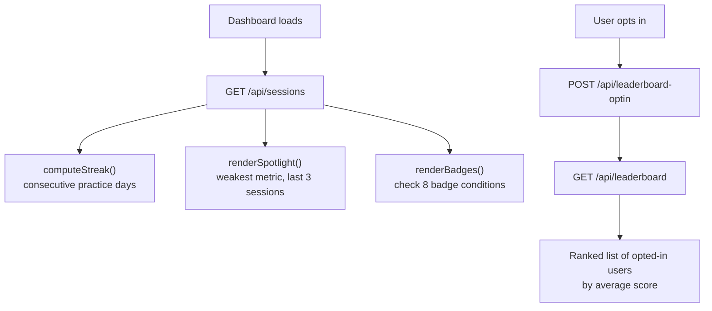
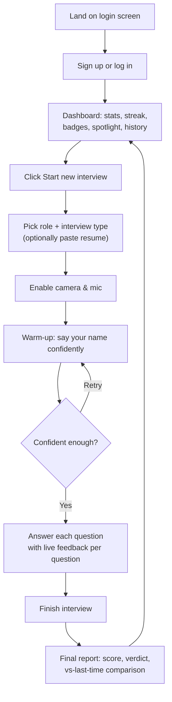

# Podium — AI-Style Mock Interview Coach

A free, self-hosted mock interview practice app. Practice on camera, get
heuristic confidence scoring (fluency, pace, voice, composure, content),
and track your progress over time — no paid services required.

---

## Features

- Camera + mic mock interviews with live speech-to-text
- Confidence scoring from real signals: filler words, speaking pace,
  voice steadiness, on-camera stillness, answer length
- Role-specific technical questions (12 tracks) + HR/behavioural rounds
- Company-style rounds: Amazon Leadership Principles, Startup culture-fit
- Resume-based personalized questions (paste your resume, get tailored
  questions about your actual projects/skills)
- Sample answers for every question, for students new to interviewing
- Dashboard: confidence trend, streaks, badges, weakest-skill spotlight
- Opt-in peer leaderboard
- Dark/light theme
- Accounts + interview history stored in a real backend (Express + SQLite)

---

## Tech Stack

| Layer | Technology |
|---|---|
| Frontend | Plain HTML / CSS / JS (`public/`) |
| Backend | Express (`server.js`) |
| Database | `node:sqlite` — Node's built-in SQLite module |
| Auth | bcrypt password hashing + random session tokens |

No paid APIs, no external database service, no native modules to compile.

---

## Project Structure

See **`structure.txt`** for the full annotated file tree.

```
Podium/
├── server.js
├── package.json
├── node.txt
├── structure.txt
├── README.md
├── Dockerfile
├── .dockerignore
├── .gitignore
└── public/
    ├── index.html
    ├── style.css
    └── app.js
```

---

## Requirements

See **`node.txt`** for full details. Short version: **Node.js 22.5.0 or
newer** (check with `node -v`), because the backend uses Node's built-in
`node:sqlite` module.

---

## Local Setup

```bash
npm install
npm start
```

Then open **http://localhost:3000**.

`podium.db` is created automatically next to `server.js` on first run —
no manual database setup.

> Camera/mic access requires `http://localhost` or `https://` — it will
> not work if you just double-click `index.html` directly.

---

## Flow Diagrams

### 1. System Architecture



### 2. Authentication Flow



### 3. Interview Recording & Scoring Flow



### 4. Resume-Based Question Generation Flow



### 5. Session Save & Comparison Flow



### 6. Badges / Streak / Leaderboard Flow



### User Flow Diagram



---

## Deploying to Hugging Face Spaces

Hugging Face Spaces can run this project using the **Docker** SDK, since
it needs an always-on server (not a serverless function like Vercel or
Netlify use, which don't keep a persistent filesystem for `podium.db`).

### Steps

1. Go to **huggingface.co** → **New Space**.
2. Choose:
   - **SDK: Docker**
   - Visibility: your choice (public/private)
3. Push this project's files (including the `Dockerfile`) to the Space's
   repo, the same way you'd push to GitHub:
   ```bash
   git remote add space https://huggingface.co/spaces/<your-username>/<space-name>
   git push space main
   ```
4. At the very top of the Space's `README.md`, Hugging Face requires a
   metadata block. Add this (edit the values as you like):
   ```yaml
   ---
   title: Podium AI Interview Coach
   emoji: 🎤
   colorFrom: yellow
   colorTo: pink
   sdk: docker
   app_port: 7860
   pinned: false
   ---
   ```
5. Hugging Face will build the `Dockerfile` automatically and start your
   app. It listens on port `7860` by default on Spaces — the
   `Dockerfile` already sets `ENV PORT=7860`, and `server.js` already
   reads `process.env.PORT`, so no code changes are needed.

### Important limitation

Free Hugging Face Spaces **do not guarantee persistent disk storage** —
the container can restart on rebuilds or after inactivity, which resets
`podium.db` back to empty. This is fine for demoing the project, but
don't rely on it for real, permanent user accounts yet. When you're
ready to expand this project, look into:
- Hugging Face's **Persistent Storage** add-on (paid, but cheap), or
- Swapping SQLite for a hosted free database like **Supabase** (Postgres)
  or **Turso** (SQLite-compatible, but hosted) — both survive restarts.

---

## Roadmap (future features)

- Real JWT-based auth with expiry + refresh tokens
- Password reset flow
- Move from SQLite to Postgres for multi-instance / persistent hosting
- Rate limiting on `/api/signup` and `/api/login`
- Optional AI-graded answer content (via an LLM) alongside the existing
  heuristic scoring
