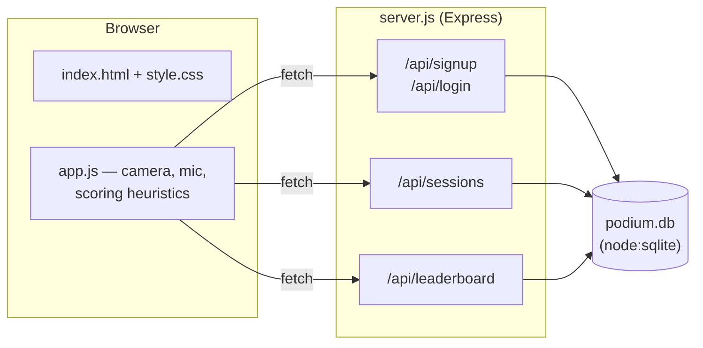
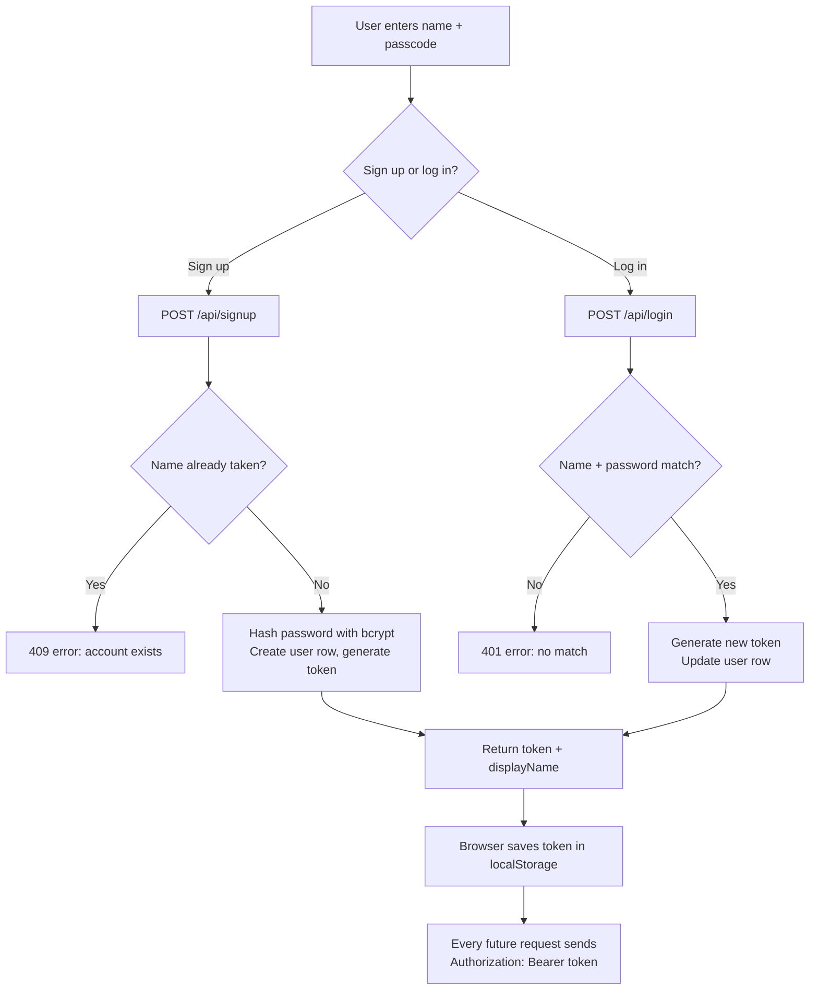
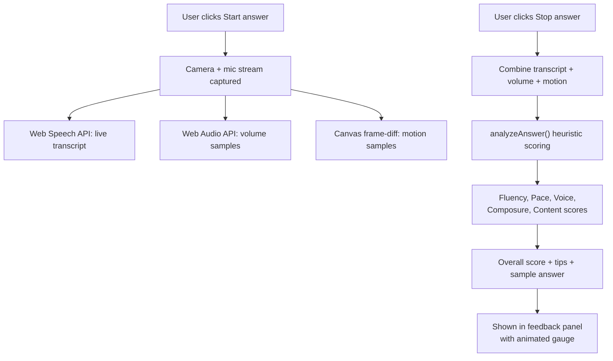
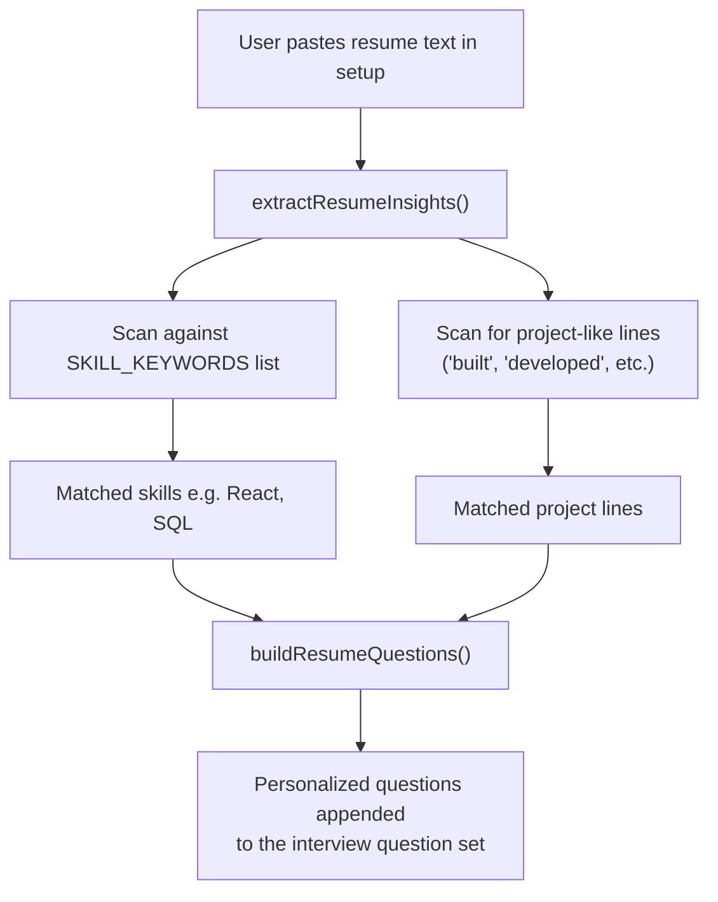
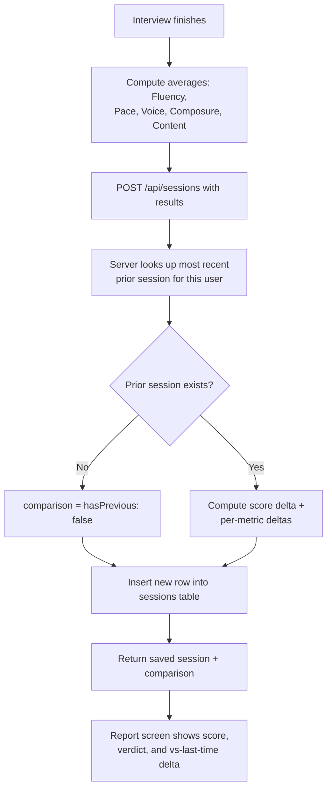
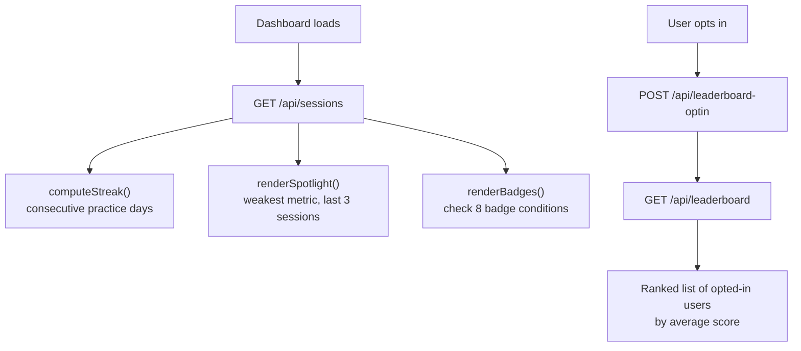
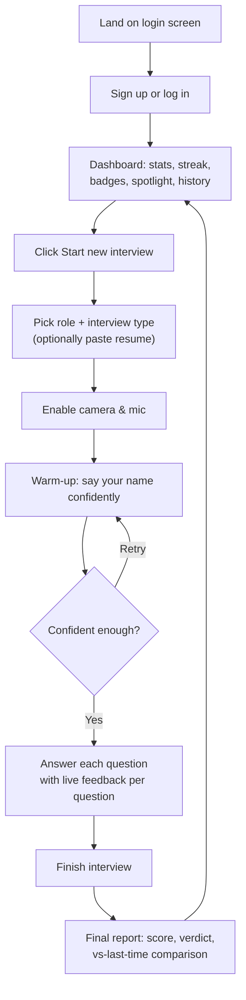

# 🎤 Podium — AI-Style Mock Interview Coach

**Practice interviews on camera and get instant, data-driven confidence feedback — built end-to-end with a custom scoring engine, a real backend, and zero paid services.**


**🔗 Live demo:** [huggingface.co/spaces/cleve05/Podium-An-interview-coach](https://cleve05-podium-an-interview-coach.hf.space)
**💻 Source:** [github.com/Kaweri05/Podium-An-interview-coach](https://github.com/Kaweri05/Podium-An-interview-coach)

---

## Table of Contents

- [Overview](#overview)
- [Features](#features)
- [Tech Stack](#tech-stack)
- [Architecture & Flow Diagrams](#architecture--flow-diagrams)
- [Getting Started](#getting-started)
- [Project Structure](#project-structure)
- [Deployment](#deployment)
- [Roadmap](#roadmap)
- [License](#license)

---

## Overview

Many students freeze up in real interviews simply from lack of practice —
not lack of ability. **Podium** is a self-hosted mock interview platform
that turns any webcam into a practice partner: it asks real interview
questions, listens and watches while you answer, and scores your
delivery on the same things a real interviewer notices — filler words,
pacing, voice steadiness, on-camera composure, and answer depth.

Everything runs on a stack I designed to be genuinely free to run and
deploy: no ML API costs, no managed database bills, no paid hosting
tier required.

## Features

- 🎥 **Camera + mic mock interviews** with live browser-based speech-to-text
- 📊 **Heuristic confidence scoring** across 5 dimensions — fluency, pace,
  voice steadiness, composure, and content — computed from real signals
  (filler-word rate, words-per-minute, mic RMS volume, canvas frame-diff
  motion detection)
- 🧑‍💼 **Role-specific technical rounds** across 12 career tracks
  (Software Engineer, Data Analyst, Marketing, Finance, Mechanical/Civil/
  Electrical Engineering, and more)
- 🏢 **Company-style rounds** — Amazon Leadership Principles, Startup
  culture-fit
- 📄 **Resume-based question generation** — paste a resume, get questions
  built around the candidate's actual projects and skills
- 💡 **Sample answers** for every question, for students new to interviewing
- 📈 **Dashboard** — confidence trend over time, day-streaks, unlockable
  badges, and a "weakest skill" spotlight with targeted tips
- 🏆 **Opt-in peer leaderboard** — useful for a college placement-cell setting
- 🌗 **Dark/light theme**
- 🔐 **Real backend** — accounts and interview history persisted in SQLite,
  not just `localStorage`

## Tech Stack

| Layer | Technology | Why |
|---|---|---|
| Frontend | Vanilla HTML / CSS / JS | No build step, fully transparent, fast to iterate on |
| Backend | Express (Node.js) | Minimal, well-understood REST API layer |
| Database | `node:sqlite` (Node's built-in SQLite) | Zero extra dependencies, zero native compilation, zero cost |
| Auth | bcrypt password hashing + token sessions | Simple, secure enough for a personal project, easy to upgrade to JWT later |
| Deployment | Docker → Hugging Face Spaces | Free, container-based, no serverless filesystem limitations |

**Browser APIs used for scoring (no ML models, no external AI calls):**
Web Speech API (transcript), Web Audio API (volume/RMS), Canvas frame-diff
(motion/composure).

## Architecture & Flow Diagrams

### 1. System Architecture



### 2. Authentication Flow



### 3. Interview Recording & Scoring Flow



### 4. Resume-Based Question Generation Flow



### 5. Session Save & Comparison Flow



### 6. Badges / Streak / Leaderboard Flow



### 7. User Flow Diagram



---

## Getting Started

### Requirements

**Node.js 22.5.0 or newer** (check with `node -v`) — the backend uses
Node's built-in `node:sqlite` module, added in that version. See
`node.txt` for upgrade instructions if you're on an older version.

### Run locally

```bash
git clone https://github.com/Kaweri05/Podium-An-interview-coach.git
cd Podium-An-interview-coach
npm install
npm start
```

Open **http://localhost:3000**. `podium.db` is created automatically on
first run — no manual database setup needed.

> Camera/mic access requires `http://localhost` or `https://` — it will
> not work if you just double-click `index.html` directly.

---

## Project Structure

Full annotated tree in `structure.txt`. Summary:

```
Podium/
├── server.js          Express API: auth, sessions, leaderboard
├── package.json        Dependencies: express, bcryptjs
├── node.txt              Node.js version requirement + notes
├── structure.txt          Full annotated file tree
├── Dockerfile              Container build for Hugging Face Spaces
├── .dockerignore
├── .gitignore
└── public/
    ├── index.html          App shell / screens
    ├── style.css            Theming, layout, components
    └── app.js                Question banks, scoring engine,
                              dashboard logic, API client
```

---

## Deployment

This project is deployed as a **Docker Space on Hugging Face** — chosen
specifically because it needs an always-on server with a real
filesystem (SQLite), which rules out serverless platforms like Vercel
or Netlify (their filesystem resets on every request, which would wipe
the database constantly).

### Deploy your own copy to Hugging Face Spaces

1. **Create the Space**
   Go to [huggingface.co](https://huggingface.co) → **New Space** →
   choose **SDK: Docker**, template **Blank**.

2. **Get a write-access token**
   [huggingface.co/settings/tokens](https://huggingface.co/settings/tokens)
   → **New token** → Write access.

3. **Push this project to the Space**
   ```bash
   git clone https://huggingface.co/spaces/<your-username>/<space-name>
   cd <space-name>
   # copy in server.js, package.json, package-lock.json, node.txt,
   # structure.txt, README.md, Dockerfile, .dockerignore, .gitignore,
   # and the public/ folder
   git add .
   git commit -m "Deploy Podium"
   git push origin main
   ```
   When prompted for a password, paste the **access token** from step 2
   (not your Hugging Face account password).

4. **Metadata block**
   The YAML block at the very top of this README (title, emoji,
   `sdk: docker`, `app_port: 7860`) is what tells Hugging Face how to
   build and run the Space — it needs to be the first thing in the file,
   with nothing before the opening `---`.

5. **Build & run**
   Hugging Face automatically builds `Dockerfile` and starts the app.
   Spaces expose port `7860` by default; the Dockerfile sets
   `ENV PORT=7860` and `server.js` already reads `process.env.PORT`, so
   no code changes are required.

### ⚠️ Known limitation

Free Hugging Face Spaces **do not guarantee persistent disk storage** —
a rebuild or restart after inactivity resets `podium.db` to empty. Fine
for a demo/portfolio deployment; for production-grade persistence,
options include Hugging Face's paid Persistent Storage add-on, or
swapping SQLite for a hosted free database like **Supabase** (Postgres)
or **Turso** (hosted SQLite).

---

## Roadmap

- [ ] Real JWT-based auth with expiry + refresh tokens
- [ ] Password reset flow
- [ ] Move to Postgres for persistent, multi-instance hosting
- [ ] Rate limiting on `/api/signup` and `/api/login`
- [ ] Optional LLM-graded answer content alongside the existing
      heuristic scoring engine
- [ ] Exportable PDF interview reports

---

## License

MIT — free to use, modify, and build on.

---

*Built by [Kaweri](https://github.com/Kaweri05) as a full-stack project
covering frontend UX, browser media APIs, backend API design, and
Docker-based deployment.*
